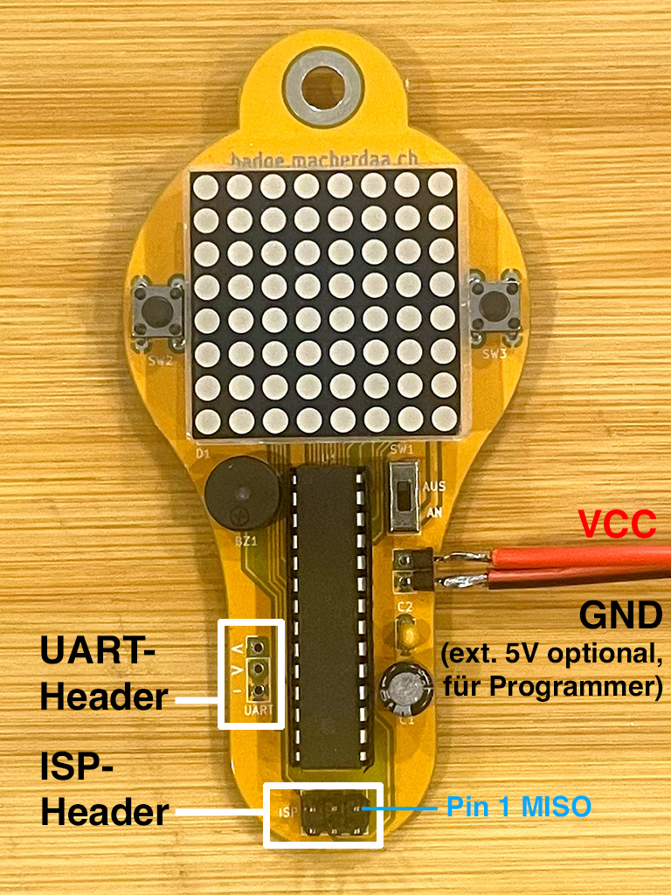
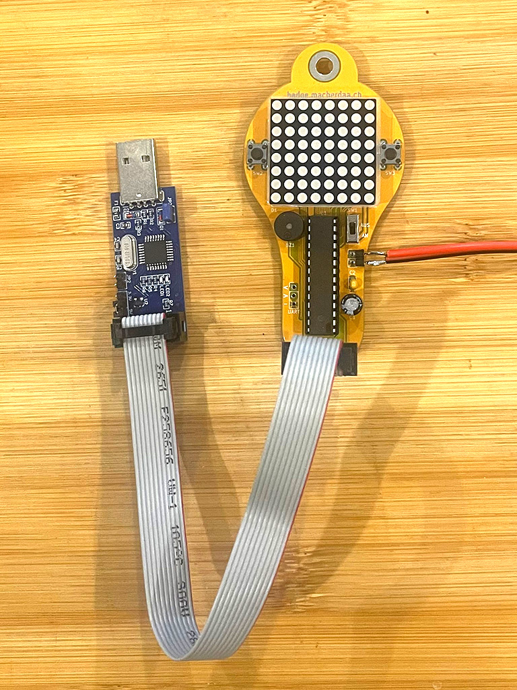
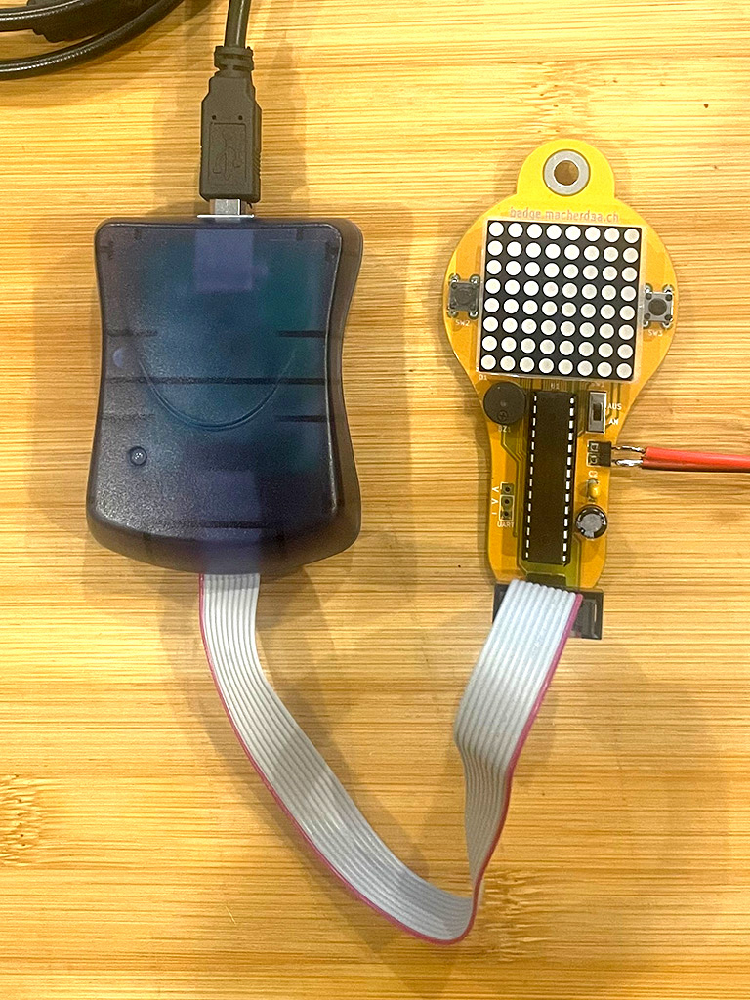

# Bedienung der MacherDaach-Badge

Die Badge hat zwei Taster:

- **Linker Taster** (SW2)
- **Rechter Taster** (SW3)

## Moduswechsel

Um vom aktuellen Modus zum nächsten zu wechseln, **beide Taster gleichzeitig für 2 Sekunden gedrückt halten**.

Die Modi werden in dieser Reihenfolge durchlaufen (danach beginnt es wieder von vorne):

1. Lauftext
2. Spirale
3. Zufallsmuster
4. Sequencer
5. Pong
6. Snake

Die beiden UART-Modi (siehe unten) gehören nicht zu diesem Umschalt-Zyklus, man gelangt aber jederzeit mit dem 2-Sekunden-Tastendruck zurück zum Lauftext-Modus, egal in welchem UART-Modus man sich gerade befindet.

## 1. Lauftext

Zeigt den einprogrammierten Text durchlaufend an, reine Anzeige ohne Tasten-Bedienung.

## 2. Spirale

Automatische Animation: die Matrix wird spiralförmig gefüllt und wieder geleert, mit kleinem Soundeffekt pro Runde. Keine Tasten-Bedienung.

## 3. Zufallsmuster

Füllt die Matrix laufend mit zufälligen Pixelmustern und spielt dazu zufällige Töne. Keine Tasten-Bedienung.

## 4. Sequencer

Ein kleiner 8-Schritt-Musiksequencer.

- Die unterste LED-Zeile zeigt den **Spalten-Cursor** (aktiver Schritt, Spalte 1-8).
- **Rechter Taster** (kurz drücken): Cursor eine Spalte nach rechts bewegen. Nach Spalte 8 geht es wieder bei Spalte 1 los.
- **Linker Taster** (kurz drücken): Tonhöhe der aktuell gewählten Spalte weiterschalten: AUS → C → D → E → F → G → A → H → AUS → ... Die Tonhöhe wird als zweite LED in der jeweiligen Zeile angezeigt (2. Zeile von unten = C, oberste Zeile = H) und beim Zeilen-Weiterschalten abgespielt.
- Während des Editierens werden die Tonhöhen **aller** Spalten gleichzeitig angezeigt, damit man das ganze Muster sieht.
- **Auto-Play**: **Wird 3 Sekunden lang keine Taste gedrückt,** läuft der Cursor automatisch durch alle 8 Spalten (ein kompletter Durchlauf dauert 2 Sekunden) und spielt dabei die programmierten Töne ab. Während des Auto-Plays wird nur die gerade abgespielte Tonhöhe angezeigt.
- Ein Tastendruck (egal welcher) beendet die automatische Wiedergabe sofort und führt die zugehörige Editieren-Aktion aus.
- Das programmierte Muster wird dauerhaft im EEPROM des ATMega Chips gespeichert und bleibt auch nach Aus- und Wiedereinschalten der Badge erhalten.

## 5. Pong

Ein einfaches Pong-Spiel, bei dem sich der Ball nur horizontal über die Matrix bewegt.

- Beim Start läuft eine kurze Einführungsanimation mit Sound.
- **Linker Taster**: linker Spieler.
- **Rechter Taster**: rechter Spieler.
- Der Ball läuft abwechselnd nach links und rechts. Erreicht er den eigenen Rand, muss man rechtzeitig den zugehörigen Taster drücken, um ihn zurückzuspielen ("Return"). Verpasst man den Moment, bekommt der Gegner einen Punkt.
- Die Punktestände werden als wachsende Balken in der obersten (rechter Spieler) bzw. untersten (linker Spieler) Zeile angezeigt.
- Wer zuerst 8 Punkte erreicht, gewinnt. Nach der Siegesanimation startet automatisch eine neue Runde, bei der der Verlierer der letzten Runde beginnt.

## 6. Snake

Das klassische Snake-Spiel auf der 8x8-Matrix.

- Beim Start läuft eine kurze Einführungsanimation mit Sound.
- **Linker Taster**: nach links abbiegen (relativ zur aktuellen Bewegungsrichtung).
- **Rechter Taster**: nach rechts abbiegen.
- Die Schlange frisst die zufällig erscheinende "Maus" (einzelner Punkt) und wird dabei länger. Am Rand der Matrix erscheint sie auf der gegenüberliegenden Seite wieder (kein Game Over bei Wandkontakt). Es gibt keine Kollisionserkennung mit dem eigenen Körper, aber eine sehr alte, lange nicht gefütterte Schlange verliert mit der Zeit Segmente am Schwanzende.

## UART-Modi (nur per PC/Serial-Verbindung)

Diese beiden Modi lassen sich **nicht** über die Taster erreichen, sondern nur, indem man über die serielle Schnittstelle (9600 Baud) Daten an die Badge sendet:

- **Text senden, abgeschlossen mit Enter (`\r`)**: aktiviert den Lauftext-Modus über UART - der gesendete Text läuft über die Matrix, ähnlich wie im normalen Lauftext-Modus, aber live vom PC gesteuert.
- **8 Byte Rohdaten senden, abgeschlossen mit Tab (`\t`)**: aktiviert den Grafik-Modus über UART - jedes der 8 gesendeten Bytes legt bitweise eine Zeile der Matrix fest.

Aus beiden UART-Modi kommt man mit dem normalen 2-Sekunden-Tastendruck (beide Taster) wieder zurück zum Lauftext-Modus.

# Entwicklungsumgebung einrichten

## VS Code und PlatformIO installieren

1. Visual Studio Code herunterladen und installieren: https://code.visualstudio.com/
2. In VS Code die Extension **"PlatformIO IDE"** installieren (Extensions-Ansicht öffnen, nach "PlatformIO IDE" suchen, installieren). PlatformIO richtet sich dabei automatisch samt aller benötigten Tools ein (u.a. `avrdude`, Compiler für die AVR-Plattform).
3. Dieses Projektverzeichnis (in dem dieses README liegt) in VS Code öffnen (Datei -> Ordner öffnen). PlatformIO erkennt die vorhandene `platformio.ini` automatisch und richtet die passende Build-Umgebung ein.

## USB-Zugriff auf den Programmer einrichten (Linux)

Unter **Linux** braucht der eigene Benutzer normalerweise eine udev-Regel, damit der ISP-Programmer ohne root-Rechte angesprochen werden kann. Die Datei `99-avrispmkII.rules` im Projektverzeichnis enthält die passende Regel (Vendor/Product ID `03eb:2104`).

**Einbau:**

1. Datei nach `/etc/udev/rules.d/` kopieren:
   ```
   sudo cp 99-avrispmkII.rules /etc/udev/rules.d/
   ```
2. Udev-Regeln neu laden:
   ```
   sudo udevadm control --reload-rules
   sudo udevadm trigger
   ```
3. Programmer einmal aus- und wieder einstecken.

Unter **Windows** ist diese Regel nicht nötig - dort braucht z.B. der USBasp ggf. stattdessen einen passenden Treiber (WinUSB/libusbK), den man über das Tool [Zadig](https://zadig.akeo.ie/) installieren kann, falls Windows den Programmer nicht automatisch erkennt. Unter **macOS** ist in der Regel keine zusätzliche Einrichtung nötig.

# Firmware flashen (ISP)

Die Badge wird über den 6-poligen ISP-Stecker programmiert, nicht per Bootloader/USB. Dafür wird ein externer ISP-Programmer benötigt. Diese Anleitung beschreibt die zwei gängigen Varianten: **USBasp** und **stk500v2** (z.B. "Arduino as ISP").

## ISP-Anschluss

```
MISO  - 1  2 - VCC (5V)
SCK   - 3  4 - MOSI
RESET - 5  6 - GND
```

Pin 1 ist am Stecker markiert. Liegt die Badge vor einem, ist Pin 1 oben rechts

Welcher Programmer aktiv verwendet wird, stellt man in `platformio.ini` über die Zeile `-cSTK500v2` bzw. `-cUSBasp` im Abschnitt `upload_flags` ein - jeweils die gewünschte Zeile aktivieren, die andere mit `;` auskommentieren.

## Variante A: USBasp



**Wichtig:** Die Badge läuft mit nur **1 MHz** Taktrate (`board_build.f_cpu = 1000000L`). Die ISP-Taktrate (SCK) muss deutlich langsamer sein als der Zieltakt (Faustregel: SCK ≤ Zieltakt / 4, also ≤ 250 kHz). Viele USBasp-Adapter kommen ab Werk mit einer **veralteten Firmware**, die keine so langsame SCK-Rate unterstützt bzw. nicht automatisch herunterschaltet - die Programmierung schlägt dann mit Sync- oder Verify-Fehlern fehl.

**Vor dem ersten Einsatz an der Badge:** den USBasp-Adapter selbst mit aktueller Firmware neu flashen (z.B. von https://www.fischl.de/usbasp/). Dafür wird ein zweiter, bereits funktionierender Programmer benötigt, da der USBasp sich nicht selbst flasht.

### Ablauf

1. USBasp mit aktueller Firmware versorgen (siehe oben).
2. ISP-Kabel des USBasp am 6-poligen ISP-Port des Badges anschließen (Pin 1 beachten).
3. Der USBasp versorgt die Badge in der Regel selbst mit 5V (Jumper JP2/JP3 auf dem USBasp, meist "Self-Powered"/5V aktiviert) - eine externe Spannungsversorgung ist normalerweise **nicht** nötig. Falls der USBasp nicht mit Strom versorgen soll, die Badge stattdessen wie bei Variante B extern versorgen.
4. In `platformio.ini` im `[env]`-Abschnitt sicherstellen, dass `-cUSBasp` aktiv ist:
   ```ini
   upload_flags =
       -C$PROJECT_PACKAGES_DIR/tool-avrdude/avrdude.conf
       -p$BOARD_MCU
       -P$UPLOAD_PORT
       ;-cstk500v2
       -cUSBasp
   ```
5. Flashen: `pio run --target upload` (oder der Upload-Button in der IDE).

**Falls es trotz aktueller Firmware nicht klappt:** in den `upload_flags` zusätzlich eine langsame ISP-Taktrate erzwingen, z.B. `-B 32` (oder einen höheren Wert) direkt hinter `-cUSBasp` ergänzen.

## Variante B: stk500v2-Programmer (z.B. Arduino as ISP)



Das ist die aktuell in `platformio.ini` voreingestellte Variante (`-cstk500v2`).

**Wichtig:** Ein stk500v2-Programmer versorgt die Badge im Gegensatz zum USBasp **nicht** mit Strom. Die Badge braucht während des Flashens eine **externe 5V-Versorgung** an den VCC/GND-Pins.

**Vor dem Anschließen der externen Versorgung:** den Schiebeschalter an der Badge von `AN` auf `AUS` umstecken, oder die Knopfzelle entnehmen - sonst kann die Batterie beschädigt werden bzw. rückgespeist werden.

### Ablauf

1. Schiebeschalter an der Badge von `AN` auf `AUS` umstellen (oder Knopfzelle entfernen).
2. Externe 5V-Versorgung an die Badge anschließen (noch nicht einschalten).
3. ISP-Kabel des stk500v2-Programmers am 6-poligen ISP-Port der Badge anschließen (Pin 1 beachten).
4. Externe Spannungsversorgung einschalten.
5. In `platformio.ini` im `[env]`-Abschnitt sicherstellen, dass `-cstk500v2` aktiv ist (Standardeinstellung):
   ```ini
   upload_flags =
       -C$PROJECT_PACKAGES_DIR/tool-avrdude/avrdude.conf
       -p$BOARD_MCU
       -P$UPLOAD_PORT
       -cstk500v2
       ;-cUSBasp
   ```
6. `upload_port` prüfen: `upload_port = usb` funktioniert nur, wenn der Programmer sich als natives USB-Gerät meldet. Meldet sich der stk500v2-Programmer stattdessen als serieller COM-Port (z.B. bei "Arduino as ISP" über den normalen USB-Seriell-Chip des Arduino), `upload_port` in `platformio.ini` auf den tatsächlichen Port ändern (z.B. `COM5` unter Windows), oder beim Upload überschreiben: `pio run --target upload --upload-port COM5`.
7. Flashen: `pio run --target upload`.
8. Nach dem Flashen: externe Versorgung trennen, Schiebeschalter wieder auf `AN` stellen bzw. Knopfzelle wieder einsetzen.

## Fuses setzen (nur einmalig bei einem neuen/unbeschriebenen Chip)

Bei einem fabrikneuen ATmega-Chip müssen einmalig die Fuses gesetzt werden (u.a. für den internen 1-MHz-Oszillator, siehe `board_fuses.*` in `platformio.ini`), bevor die Firmware zum ersten Mal geflasht wird:

```
pio run --target fuses
```

Das ist nur beim allerersten Programmieren eines neuen Controllers nötig, nicht bei jedem normalen Firmware-Update. Und normalerweise wurde Deine Badge ja schon vor Ort auf dem Macherdaach programmiert.

# Variante C: Arduino Uno als ISP-Programmer

Hat man keinen USBasp oder stk500v2-Programmer zur Hand, lässt sich ein handelsüblicher Arduino Uno als ISP-Programmer verwenden ("Arduino as ISP"). Der Uno übernimmt technisch das gleiche Protokoll wie sein eigener Bootloader (`stk500v1`) und kann die Badge direkt über seine 5V/GND-Pins mit Strom versorgen.

## 1. Uno als Programmer vorbereiten (einmalig)

1. Arduino IDE öffnen, den Uno wie gewohnt per USB anschließen und auswählen.
2. Beispiel-Sketch **Datei -> Beispiele -> 11.ArduinoISP -> ArduinoISP** öffnen und ganz normal auf den Uno hochladen (das ist ein einmaliger, normaler USB-Upload, kein ISP-Vorgang).
3. Der Uno agiert danach als ISP-Programmer, solange dieser Sketch auf ihm läuft.

**Tipp:** Falls die Verbindung zum Zielchip immer wieder abbricht/resettet, einen 10-100 µF Kondensator zwischen `RESET` und `GND` des Uno stecken (verhindert, dass der Uno sich beim Öffnen der seriellen Verbindung selbst zurücksetzt).

## 2. Verkabelung Uno -> Badge-ISP-Header

| Badge ISP-Pin | Funktion | Arduino Uno Pin |
| ------------- | -------- | ---------------- |
| 1             | MISO     | D12               |
| 2             | VCC (5V) | 5V                |
| 3             | SCK      | D13               |
| 4             | MOSI     | D11               |
| 5             | Reset    | D10               |
| 6             | GND      | GND               |

Der Uno versorgt die Badge dabei direkt mit 5V - wie bei Variante B (stk500v2) vorher den Schiebeschalter an der Badge von `AN` auf `AUS` stecken bzw. die Knopfzelle entnehmen, bevor die Verbindung hergestellt wird.

## 3. Mit PlatformIO flashen

Der Uno-als-ISP nutzt das `stk500v1`-Protokoll (nicht `stk500v2`!) und braucht zwingend 19200 Baud sowie den tatsächlichen seriellen Port des Uno (kein `usb`). Im `[env]`-Abschnitt von `platformio.ini`:

```ini
upload_speed = 19200
upload_protocol = custom
upload_port = COM5   ; tatsächlichen COM-Port des Uno eintragen (Linux/macOS z.B. /dev/ttyACM0)
upload_flags =
    -C$PROJECT_PACKAGES_DIR/tool-avrdude/avrdude.conf
    -p$BOARD_MCU
    -P$UPLOAD_PORT
    -b$UPLOAD_SPEED
    -cstk500v1
upload_command = avrdude $UPLOAD_FLAGS -U flash:w:$SOURCE:i
```

Anschließend wie gewohnt flashen:

```
pio run --target upload
```

Nach dem Flashen die externe Versorgung/den Uno trennen und den Schiebeschalter aan der Badge wieder auf `AN` stellen bzw. die Knopfzelle wieder einsetzen.

