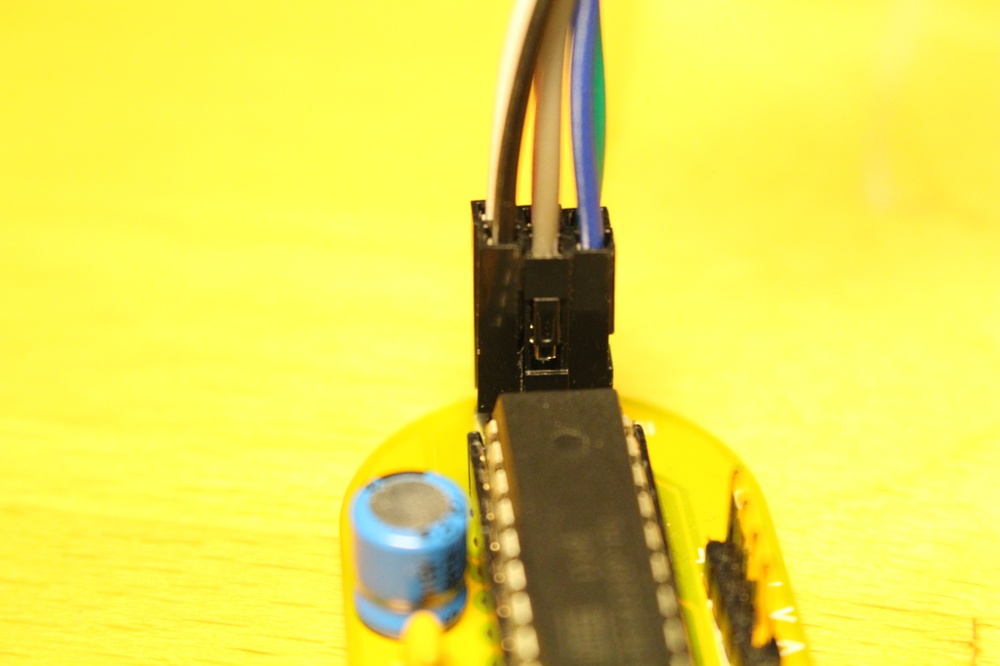

# MacherDaachBadgeFirmware

## Verbinden des Arduinos mit dem Badge

### ISP Pinheader (6 polig)
Pin 1 des Steckers ist markiert. Wenn der Badge vor einem liegt oben rechts.

```
MISO  - 1  2 - VCC (5V)
SCK   - 3  4 - MOSI
Reset - 5  6 - GND
```

### Verkabelung

Badge    | Farbe    | Arduino
-------- | -------- | --------
ISP 1    | Schwarz  | 12
ISP 2    | Weiß     | 5V
ISP 3    | Grau     | 13
ISP 4    | Lila     | 11
ISP 5    | Blau     | 10
ISP 6    | Grün     | GND

**!! Achtung !!**
Vor dem Anschließen der Spannungsversorgung des Arduinos, muss der Jumper von BAT auf EXT gesetzt werden oder die Knopfzelle entnommen werden.

### Bilder




## Vorbereiten der Arduino IDE

### Board anlegen
Im Arduino Ordner folgende Struktur anlegen:
*hardware/macherDaachBadge/avr/bootloaders/atmega*
In den avr Ordner dann die boards.txt Datei und in den atmega Ordner die optiboot_atmega328.hex kopieren.

In dieser Datei ist definiert, dass wir keinen Standard Arduino UNO benutzen sondern einen Arduino ohne Quarz und mit einem Takt von 1 MHz.

### Timer Library einbinden
Wir verwenden eine fertige Timerlibrary 
Die Dokumentation zur Library findet sich hier:
[https://playground.arduino.cc/Deutsch/HalloWeltMitInterruptUndTimerlibrary](https://playground.arduino.cc/Deutsch/HalloWeltMitInterruptUndTimerlibrary) 

#### Automatisches einbinden der Library:
1. Sketch -> Bibliothek einbinden -> Bibliothek verwalten

2. TimerOne im Suchfeld eingeben und die Library mit "Installieren" bestätigen


#### Manuelles einbinden der Library: 
[http://playground.arduino.cc/uploads/Code/TimerOne.zip](http://playground.arduino.cc/uploads/Code/TimerOne.zip) 
Der entpackte Ordner muss im Arduino Verzeichnis im Ordner *libraries* abgelegt werden.

## Den Arduino zum Programmer machen
Die Langanleitung findet sich hier:
[https://www.arduino.cc/en/Tutorial/ArduinoISP](https://www.arduino.cc/en/Tutorial/ArduinoISP) 

Die Kurzbeschreibung lautet:
In einem neuen Sketch
1. Werkzeuge -> Board -> Arduino/Genuino UNO
2. Werkzeug -> Port -> ttyACM0 (oder irgendwetwas anderes z.B. ttyUSB0)
3. Datei -> Beispiele -> 11.ArduinoISP
4. Überprüfen 
5. Hochladen

## Den Badge programmieren
Im Macher_Daach_Badge_Firmware Sketch:
1. Werkzeuge -> Board -> Macher Daach Badge (1 MHz internal clock)
2. Programmer -> Arduino as ISP
3. Überprüfen
4. !!! Vor dem aller ersten Programmieren einmal Werkzeuge -> Bootloader brennen
5. Shift gedrückt halten und Hochladen