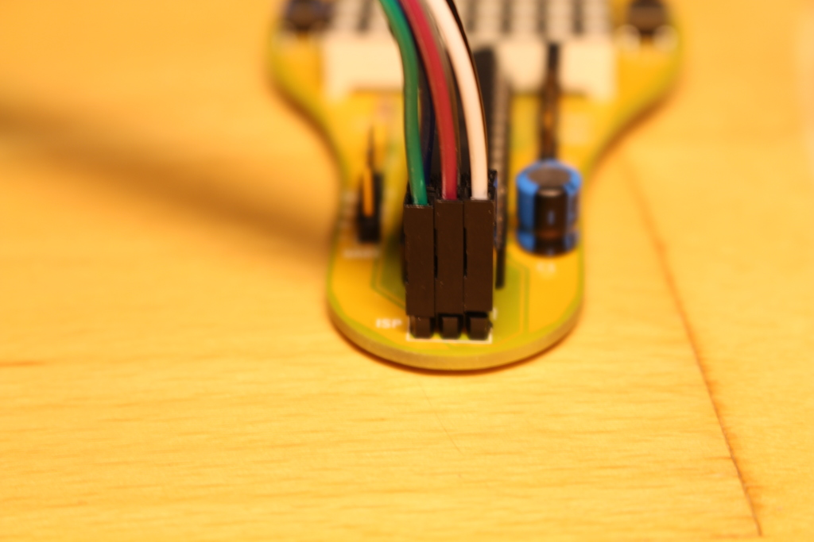
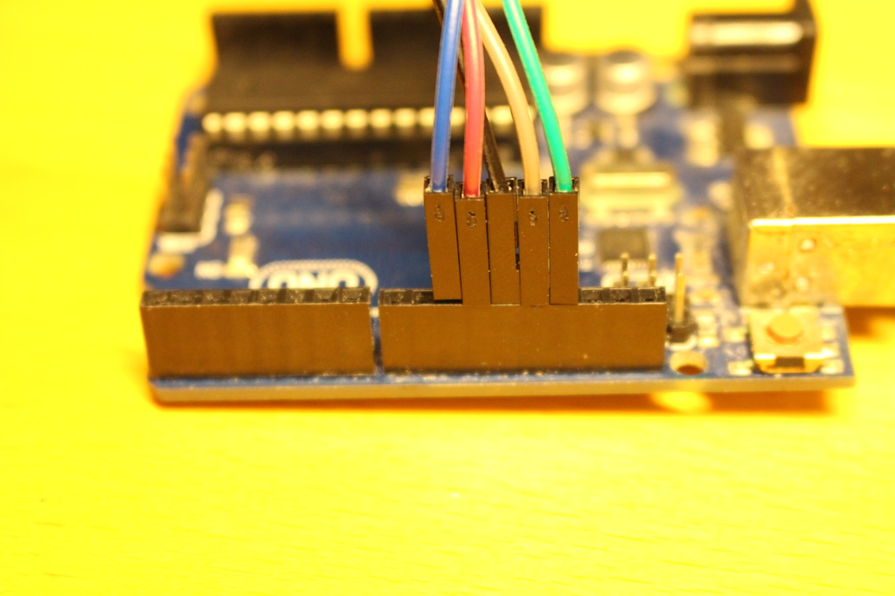

# MacherDaachBadgeFirmware
##Verbinden des Arduinos mit dem Badge

###ISP Pinheader (6 polig)
Pin 1 des Steckers ist markiert. Wenn der Badge vor einem liegt oben rechts.

.        | .
-------- | --------
1 - MISO | 2 - VCC (5V)
3 - Reset| 4 - MOSI
5 - SCK  | 6 - GND

**!! Achtung !!**
Der Pinheader entspricht im Moment nicht dem Standard.
Reset und SCK sind vertauscht. Die Tabelle entspricht der aktuellen Hardware. Die beiden Pins werden jedoch in der nächsten Revision getauscht.

###Verkableung

Badge    | Farbe    | Arduino
-------- | -------- | --------
ISP 1    | Schwarz  | 12
ISP 2    | Weiß     | 5V
ISP 3    | Grau     | 10
ISP 4    | Lila     | 11
ISP 5    | Blau     | 13
ISP 6    | Grün     | GND

**!! Achtung !!**
Vor dem Anschließen der Spannungsversorgung des Arduinos, muss die Batterie entfernt werden.

###Bilder
{ width=50% }
{ width=50% }
{ width=50% }
{ width=50% }

##Vorbereiten der Arduino IDE
###Board anlegen
Im Arduino Ordner folgende Struktur anlegen:
*hardware/macherDaachBadge/avr*
In den avr Ordner dann die boards.txt Datei kopieren.

In dieser Datei ist definiert, dass wir keinen Standard Arduino UNO benutzen sondern einen Arduino ohne Quarz und mit einem Takt von 1 MHz.
###Timer Library einbinden
Wir verwenden eine fertige Timerlibrary 
Die Dokumentation zur Library findet sich hier:
[https://playground.arduino.cc/Deutsch/HalloWeltMitInterruptUndTimerlibrary](https://playground.arduino.cc/Deutsch/HalloWeltMitInterruptUndTimerlibrary) 

Und herunterladen kann man die Library hier: 
[http://playground.arduino.cc/uploads/Code/TimerOne.zip](http://playground.arduino.cc/uploads/Code/TimerOne.zip) 
Der entpackte Ordner muss im Arduino Verzeichnis im Ordner *libraries* abgelegt werden.
##Den Arduino zum Programmer machen
Die Langanleitung findet sich hier:
[https://www.arduino.cc/en/Tutorial/ArduinoISP](https://www.arduino.cc/en/Tutorial/ArduinoISP) 

Die Kurzbeschreibung lautet:
In einem neuen Sketch
1. Werkzeuge -> Board -> Arduino/Genuino UNO
2. Werkzeug -> Port -> ttyACM0 (oder irgendwetwas anderes z.B. ttyUSB0)
3. Datei -> Beispiele -> 11.ArduinoISP
4. Überprüfen 
5. Hochladen
##Den Badge programmieren
Im Macher_Daach_Badge_Firmware Sketch:
1. Werkzeuge -> Board -> Macher Daach Badge (1 MHz internal clock)
2. Programmer -> Arduino as ISP
3. Überprüfen
4. Shift gedrückt halten und Hochladen